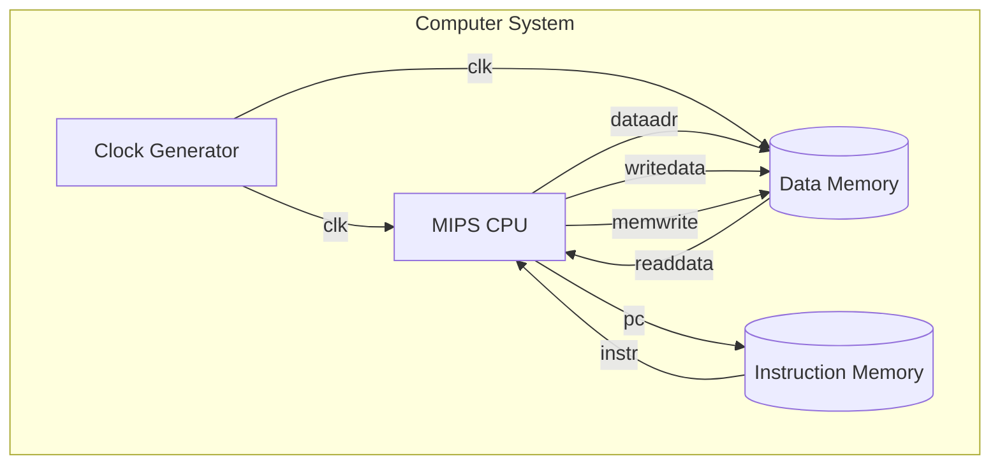
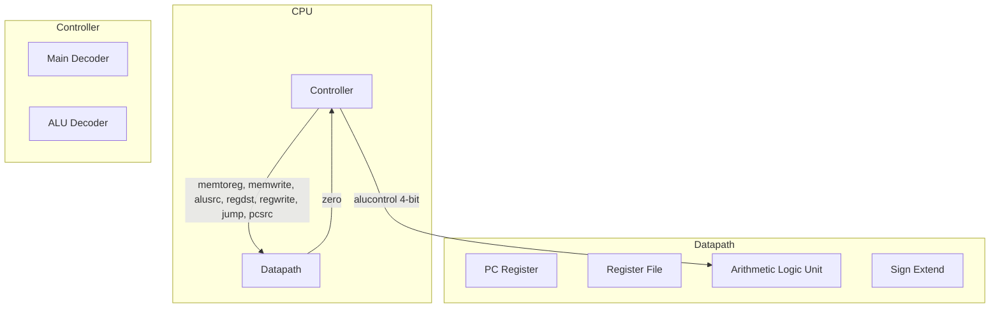
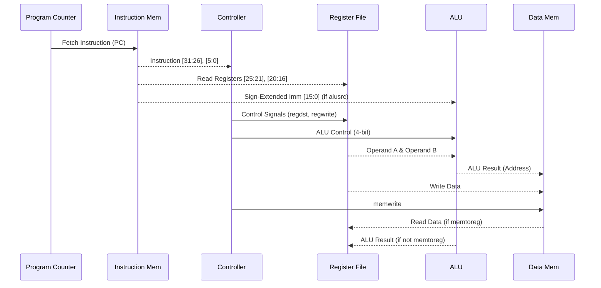

# MIPS Single-Cycle Architecture

## Solution Architecture

## CPU Internal Architecture

## Instruction Execution Sequence

## Unimplemented Designs (Future Work)
The current single-cycle MIPS implementation is functional but currently lacks the following common CPU architecture features:
- **Pipelining**: Breaking down the cycle into IF, ID, EX, MEM, WB stages using pipeline registers.
- **Hazard Detection & Forwarding Unit**: Required to resolve data and control hazards if pipelining is introduced.
- **Exception Handling (Coprocessor 0)**: Support for handling internal exceptions (overflows, undefined instructions) and external interrupts.
- **Floating-Point Unit (Coprocessor 1)**: For hardware acceleration of IEEE 754 operations.
- **Cache Memory**: Replacing direct combinatorial memory access with hierarchical L1/L2 caches.
- **Branch Prediction**: Static or dynamic branch predictors to minimize control hazard penalties.
