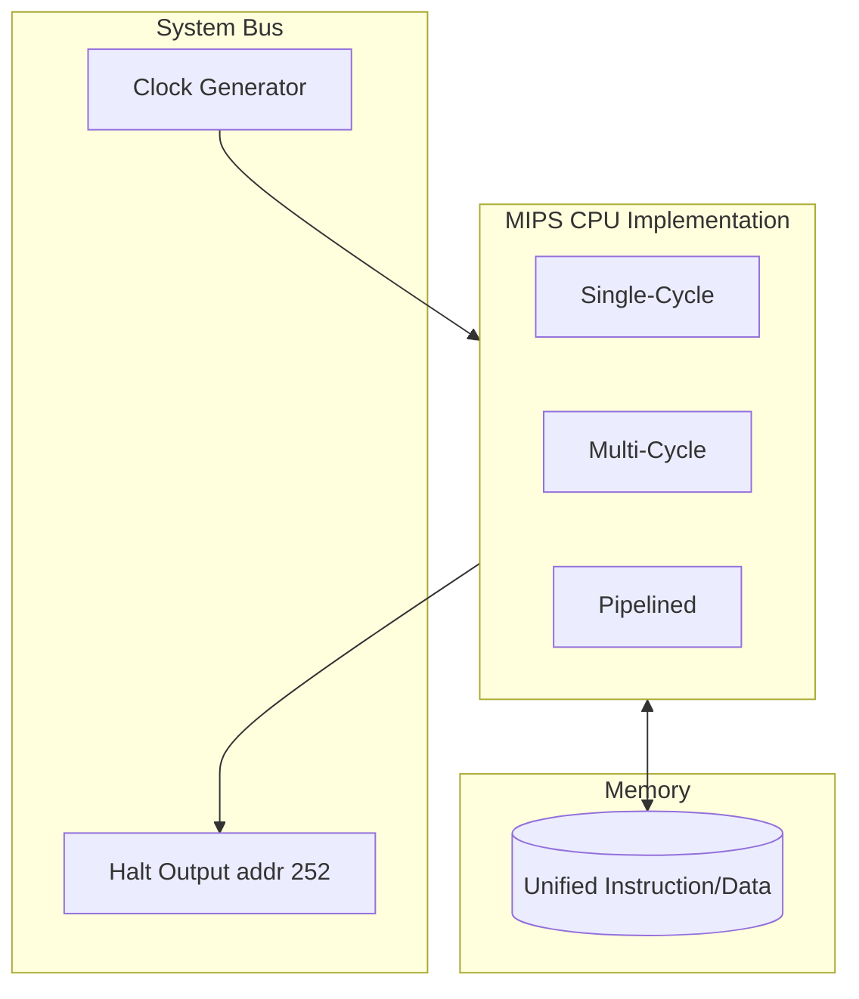
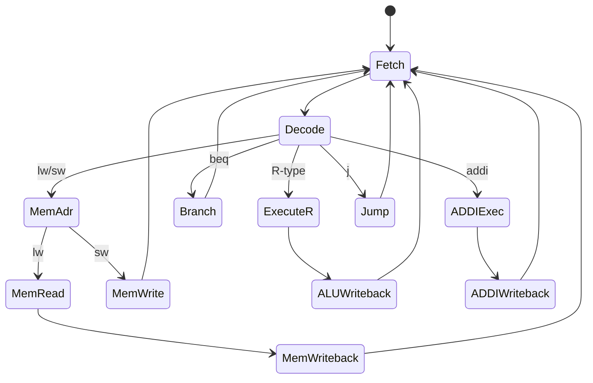
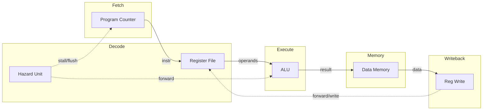

# MIPS CPU Architecture Documentation

This project catalogs three fundamental ways to implement the MIPS32 RISC instruction set.

## 1. Unified Solution Architecture

All three implementations share the same external memory and I/O interface.

---

## 2. Multi-Cycle State Machine (FSM)

The multi-cycle implementation shares a single ALU and memory, transitioning through states to complete an instruction.

### FSM State Mechanisms
To reuse hardware (ALU and Memory), the FSM generates control signals that change the function of components each cycle:

1.  **Fetch**: Reads the instruction from memory (`IR = Mem[PC]`) and increments the PC (`PC = PC + 4`). 
    *   *Signals*: `IorD=0`, `MemRead=1`, `IRWrite=1`, `ALUSrcA=0`, `ALUSrcB=01`, `ALUOp=00`, `PCWrite=1`.
2.  **Decode**: Computes the branch target address in advance (`ALUOut = PC + (sign-ext(imm) << 2)`) and reads registers into `A` and `B`.
    *   *Signals*: `ALUSrcA=0`, `ALUSrcB=11`, `ALUOp=00`.
3.  **ExecuteR**: Performs the R-type operation using operands from registers `A` and `B`.
    *   *Signals*: `ALUSrcA=1`, `ALUSrcB=00`, `ALUOp=10`.
4.  **MemAdr**: Computes the effective memory address for `lw` or `sw`.
    *   *Signals*: `ALUSrcA=1`, `ALUSrcB=10`, `ALUOp=00`.
5.  **MemRead / MemWrite**: Accesses unified memory using the computed address in `ALUOut`.
    *   *Signals (Read)*: `IorD=1`, `MemRead=1`.
    *   *Signals (Write)*: `IorD=1`, `MemWrite=1`.
6.  **Writeback**: Commits the ALU result or memory data back to the register file.
    *   *Signals (ALU)*: `RegDst=1`, `RegWrite=1`, `MemToReg=0`.
    *   *Signals (Mem)*: `RegDst=0`, `RegWrite=1`, `MemToReg=1`.

---

## 3. Pipelined Architecture (5 Stages)

The pipelined implementation overlaps instruction execution using registers between stages.

---

## 4. Hardware Standard: 4-bit ALU Control

All architectures use this unified 4-bit control mapping:

| ALUControl | Operation | MIPS Funct/Op |
| :--- | :--- | :--- |
| `0000` | AND | `0x24` |
| `0001` | OR | `0x25` |
| `0010` | ADD | `0x20` / `0x08` (addi) |
| `0011` | NOR | `0x27` |
| `0100` | MFLO | `0x12` |
| `0101` | MFHI | `0x10` |
| `0110` | SUB | `0x22` |
| `0111` | SLT | `0x2a` |
| `1000` | MULT | `0x18` |
| `1001` | DIV | `0x1a` |

---

## 5. Unimplemented Designs (Future Work)

- **Precise Exception Handling**: The pipelined model needs to capture the correct PC in the `EPC` register during a flush to allow for instruction re-execution.
- **Dynamic Branch Prediction**: Replace the current stall-based or static prediction with a Branch Target Buffer (BTB).
- **L1 Cache**: Separate Instruction and Data caches to resolve memory contention in the pipelined model.
- **Floating Point Unit (FPU)**: Integration of MIPS Coprocessor 1.
